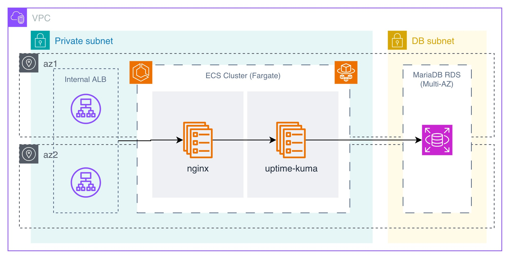

<!-- BEGIN_TF_DOCS -->
# Uptime Kuma Terraform Module

    

## Architecture Diagram



## Overview

[Uptime Kuma](https://github.com/louislam/uptime-kuma) is a self-hosted monitoring tool used to track the availability and response times of PlanetView services. It is deployed as an internal service within the shared services AWS account and is **not** publicly accessible — access requires an AWS Client VPN connection.

The service runs on ECS Fargate (ARM64) behind an Application Load Balancer and uses a MariaDB database on RDS for persistent storage. An nginx reverse proxy sits in front of Uptime Kuma to handle HTTP routing and health checks.

This terraform module will deploy the following services:
- Route53 Record
- ALB
- ECS Cluster
- RDS MariaDB
- SSM Parameter Store
- IAM Roles

# Usage Instructions
## Example
```hcl
module "uptime_kuma" {
  source = "github.com/paliwalvimal/uptime-kuma-aws-tf.git?ref=" # Always use `ref` to point module to a specific version or hash

  vpc_id          = "vpc-xxxxxxxxxx"
  alb_subnet_ids  = ["subnet-xxxxxxxxxx", "subnet-xxxxxxxxxx"]
  route53_zone_id = "xxxxxxxxxx"
  domain_name     = "example.com"
  db_subnet_ids   = ["subnet-xxxxxxxxxx", "subnet-xxxxxxxxxx"]
  ecs_subnet_ids  = ["subnet-xxxxxxxxxx", "subnet-xxxxxxxxxx"]
}
```

## Requirements

| Name | Version |
|------|---------|
| terraform | >= 1.12.0 |
| aws | >= 6.0.0 |
| random | >= 3.8.1 |

## Inputs

| Name | Description | Type | Default | Required |
|------|-------------|------|---------|:--------:|
| alb_subnet_ids | List of subnet IDs to deploy the application load balancer | `list(string)` | n/a | yes |
| cw_logs_kms_key_id | KMS key ID to use for encrypting CloudWatch logs | `string` | `null` | no |
| cw_logs_retention_days | Number of days to retain CloudWatch logs | `number` | `90` | no |
| db_allocated_storage | Allocated storage for the RDS database | `number` | `50` | no |
| db_allow_major_version_upgrade | Whether to auto upgrade major version for database | `bool` | `false` | no |
| db_apply_changes_immediately | Whether to apply changes to the RDS instance immediately instead of scheduling it | `bool` | `true` | no |
| db_auto_minor_version_upgrade | Whether to auto upgrade minor version for database | `bool` | `true` | no |
| db_backup_retention_period | Number of days to retain the automatic backups | `number` | `7` | no |
| db_backup_window | Backup window to set for the RDS instance | `string` | `"03:00-06:00"` | no |
| db_ca_cert_identifier | CA certification to use for the RDS instance | `string` | `"rds-ca-rsa2048-g1"` | no |
| db_cloudwatch_logs_exports | List of log types to export to CloudWatch for the RDS instance. Check [AWS doc](https://docs.aws.amazon.com/AmazonRDS/latest/UserGuide/USER_LogAccess.MariaDB.PublishtoCloudWatchLogs.html) for supported log types | `list(string)` | ```[ "general", "audit", "error", "slowquery" ]``` | no |
| db_create_subnet_group | Whether to create a new subnet group for RDS instance | `bool` | `true` | no |
| db_enable_deletion_protection | Whether to enable deletion protection for the RDS instance | `bool` | `true` | no |
| db_engine_version | Engine version to use for mariadb database | `string` | `"11.8.6"` | no |
| db_family | Family for the RDS database | `string` | `"mariadb11.8"` | no |
| db_instance_type | Instance type for the RDS database | `string` | `"db.t4g.small"` | no |
| db_kms_key_id | KMS key ARN to use for encrypting the RDS database. If not provided, default KMS key will be used | `string` | `null` | no |
| db_maintenance_window | Maintenance window to set for the RDS instance | `string` | `"Sun:00:00-Sun:03:00"` | no |
| db_max_allocated_storage | Max allocated storage for the RDS database | `number` | `500` | no |
| db_multi_az | Whether to create a multi-az RDS instance | `bool` | `true` | no |
| db_name | Default database to create for mariadb | `string` | `"uptime_kuma"` | no |
| db_password_version | To change database password, taint the random_password ephemeral resource and update the version number to update database password value in SSM parameter and RDS instance | `number` | `1` | no |
| db_performance_insights_enabled | Whether to enable performance insights for RDS instance | `bool` | `false` | no |
| db_port | Port on which mariadb will listen for incomming traffic | `number` | `3306` | no |
| db_publicly_accessible | Whether to create a public facing RDS instance | `bool` | `false` | no |
| db_skip_final_snapshot | Whether to skip final snapshot before deleting RDS instance | `bool` | `false` | no |
| db_subnet_group_name | Subnet group name to use for the RDS database | `string` | `""` | no |
| db_subnet_ids | List of subnet IDs to use for creating db subnet group. Note: Required if `db_create_subnet_group` is set to true | `list(string)` | `[]` | no |
| db_username | Master/admin user to create for mariadb | `string` | `"admin"` | no |
| domain_name | Domain name to use for creating ALB DNS record | `string` | n/a | yes |
| ecs_container_insights_level | Container Insights level for ECS cluster. Supported values: `enhanced`, `enabled`, `disabled` | `string` | `"enhanced"` | no |
| ecs_enable_guardduty_monitoring | Whether to enable AWS GuardDuty Runtime Monitoring for the ECS cluster | `bool` | `true` | no |
| ecs_nginx_image | Nginx image to use for the ECS task | `string` | `"mirror.gcr.io/nginxinc/nginx-unprivileged@sha256:846c4e33797e325a2f3d623d590610e5da8044fa907db91ce4c80dfa14d1df84"` | no |
| ecs_subnet_ids | List of subnet IDs to deploy the ECS task | `list(string)` | n/a | yes |
| ecs_task_appautoscaling_threshold | Threshold to use for scaling the service | `string` | `"60"` | no |
| ecs_task_family | Name of the ECS task family | `string` | `"uptime-kuma"` | no |
| ecs_task_iam_role_policy | IAM role policy to attach to the ECS task IAM role | `string` | `""` | no |
| ecs_task_max_capacity | Max number of tasks to run for the service | `string` | `"4"` | no |
| ecs_task_min_capacity | Min number of tasks to always run for the service | `string` | `"1"` | no |
| ecs_uptime_kuma_image | Uptime Kuma image to use for the ECS task | `string` | `"mirror.gcr.io/louislam/uptime-kuma@sha256:44014bc55a42037105faf371963dda525378cf8866b9b883c38ec18e54b9bd54"` | no |
| name_prefix | Prefix to add to the name of all the resources created by this module | `string` | `"vp-"` | no |
| route53_zone_id | Route53 zone ID in which to create the ALB DNS record | `string` | n/a | yes |
| tags | A map of key value pair to assign to resources | `map(string)` | `{}` | no |
| vpc_id | ID of the VPC to deploy resources | `string` | n/a | yes |

## Outputs

| Name | Description |
|------|-------------|
| alb_arn | ARN of the application load balancer |
| alb_dns_name | The DNS name of the load balancer |
| alb_id | ID of the application load balancer |
| alb_security_group_arn | ARN of the security group associated to the application load balancer |
| alb_security_group_id | ID of the security group associated to the application load balancer |
| db_instance_arn | ARN of RDS instance |
| db_security_group_arn | ARN of security group created for RDS instance |
| db_security_group_id | ID of security group created for RDS instance |
| db_ssm_parameter_arn | ARN of SSM parameter that holds RDS master/admin password |
| db_ssm_parameter_name | Name of SSM parameter that holds RDS master/admin password |
| ecs_cloudwatch_log_group_arn | ARN of CloudWatch log group created for ECS cluster |
| ecs_cluster_arn | ARN of the ECS cluster |
| ecs_security_group_arn | ARN of security group created for ECS task |
| ecs_security_group_id | ID of security group created for ECS task |
| ecs_service_arn | ARN of ECS service |
| ecs_task_definition_arn | ARN of the task definition including both family and revision |
| ecs_task_definition_arn_no_revision | ARN of the task definition without revision |
| ecs_task_definition_revision | Revision of the task definition |
| ecs_task_execution_role_arn | ARN of ECS task execution IAM role |
| ecs_task_execution_role_name | Name of ECS task execution IAM role |
| ecs_task_role_arn | ARN of ECS task IAM role |
| ecs_task_role_name | Name of ECS task IAM role |

<!-- END_TF_DOCS -->
